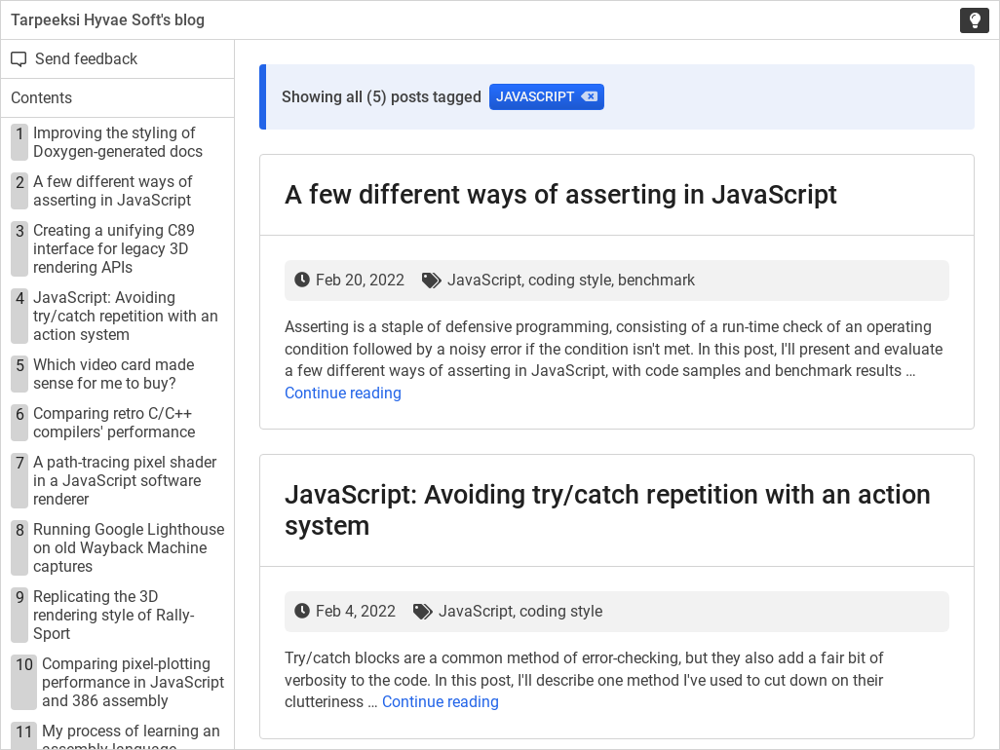

# dokki

A documentation framework for creating single-page end-user-oriented docs.

Dokki is currently work in progress.

\
*Viewing a document created with dokki (dokki being used as a blogging platform).*

## Where's the rest?

Since dokki is work in progress, this readme is a bit light on content for the moment. More info will be added in the future as the software matures.

That said, dokki is already running production. You can find a sample of it on [my blog](https://tarpeeksihyvaesoft.com/blog/), which is written entirely using dokki.

The contents of the [docs/](./docs) folder are hosted live:

- [API reference](https://www.tarpeeksihyvaesoft.com/dokki/docs/api-reference.html)
- [Sample document](https://www.tarpeeksihyvaesoft.com/dokki/docs/sample.html)
